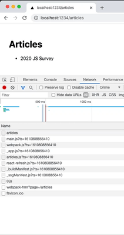
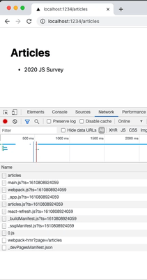

# Next.js

> Learn Next.js 🚀

> with [Next.js Official](https://nextjs.org/) & [Codelab Youtube Channel](https://www.youtube.com/channel/UC7SGsu80wfuTyQWo-PKatvg)

# Features

> Next.js의 여러가지 특징에 대해서 알아보자 🥸

## Pages

- 넥스트에서의 pages의 디렉토리는 특별하다. pages 안의 디렉토리/파일 구조가 사이트에서의 url이 된다.

  ```
  pages 안에 article 디렉토리를 만들고 article 디렉토리 안에 first-article.js 라는 파일을 만든다면 어떻게 될까?
  ```

  > `http://localhost:PORT/articles/first-article` 이라는 url이 자동으로 생성되어 해당 컴퍼넌트가 출력된다.

- `index.js`라는 파일을 특정 디렉토리에서 생성한다면, 그 index.js 파일은 그 디렉토리를 대표하게 된다. 이 말은 index.js는 특정 디렉토리가 갖게되는 url을 대표하게 된다는 말과 같다.

  > 예를 들어서 articles 디렉토리 안에 index.js를 생성한다면, `http://localhost:PORT/articles` 접근하게 되면 index.js가 열리게 된다.

- Link : exported by `next/link`

  리액트에서도 `Link` 라는 컴퍼넌트를 사용한적이 있다. 기본적으로 `a 태그`를 사용하면 새로고침이 되면서 페이지 이동을 하게 되지만,`Link`를 사용하게 되면 자연스럽 새로고침없이 이동된다.(Link는 this.props.children에 해당하는 부분만 리랜더링 해준다.) 이는 SSR(Server Side Rendering)에서 CSR(Client Side Rendering)으로 변화시켜준다고 생각하면 된다. 이와 마찬가지로 넥스트에서도 Link를 사용하여 페이지 이동을 CSR로서 나타낼 수 있다.

  > Link의 추가 전/후를 개발자 도구의 네트워크 탭을 통해서 비교해보면 좀 더 명확하게 알 수 있다. 추가 전에는 페이지를 누를 때마다 네트워크 탭 안의 정보가 새로고침 되었다. 하지만 추가 후에는 기존의 정보를 그대로 둔 후 랜더링에 필요한 정보만을 추가하는 것을 볼 수 있다.(직접 확인해보면 명확해진다.)

  &nbsp;&nbsp;&nbsp;

  > 왼쪽은 a 태그일 때, 오른쪽은 Link일 때이다. `2020 JS Survey`를 클릭할 때의 차이를 살펴보자. (왼쪽 사진에서 뒤로가기 버튼 역시 a 태그이다.) 왼쪽에서는 상단의 새로고침 표시가 보여지고 네트워크 탭 내용 역시 새로고침되는 것을 볼 수 있다. 반대로 오른쪽에서는 상단의 새로고침 표시에는 변함이 없고 네트워크 탭 내용에서 필요한 부분만 추가되는 것을 볼 수 있다.
